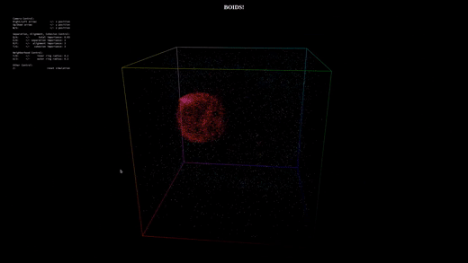

# Toroidal-Boids

An implementation of the flocking behavior commonly known as [BOIDS](https://en.wikipedia.org/wiki/Boids). Boids are an artificial life program which simulate flocking with only three agent-based rules:

* **Separation**: Steer to keep at least a minimum distance from neighboring boids
* **Alignment**: Steer to align oneself with close boids
* **Cohesion**: Steer to keep oneself in the neighborhood of other boids.

Together these are called **SAC** principles.

Separation and Cohesion may seem at odds, but Cohesion works on a much larger neighborhood than Separation.

This simulation is written in webGL with addons from [stack.gl](stack.gl). As much of the processing as possible is pushed to the GPU with framebuffers.

This project is affectionately known as BORGS, due to the simularity beween the words BORG and BOID, and the Borgs' famous spaceship, the [Borg Cube](https://www.startrek.com/database_article/borg-cube)

A video of the simulation can be found [here](https://youtu.be/FO2auCMscuQ).
